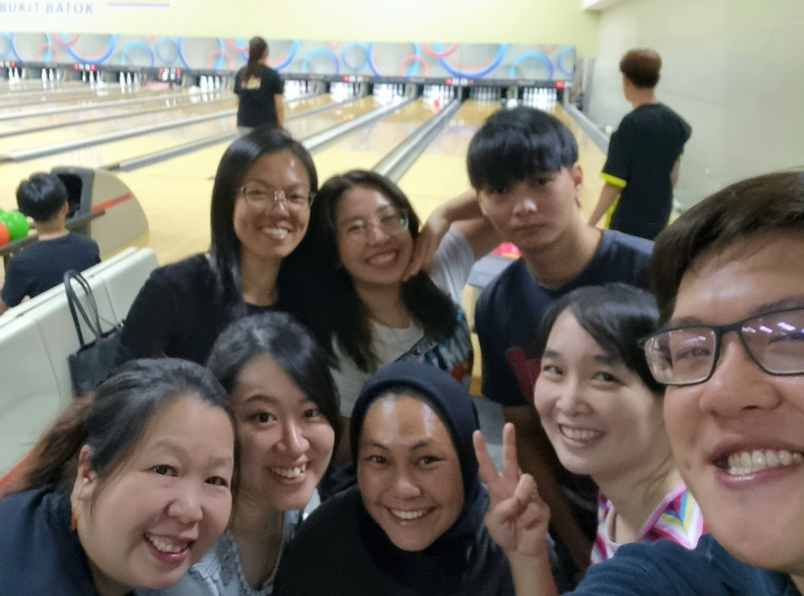
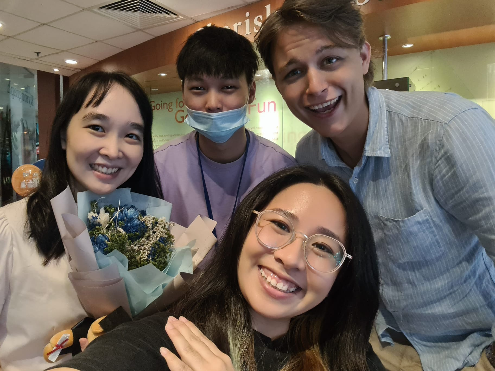
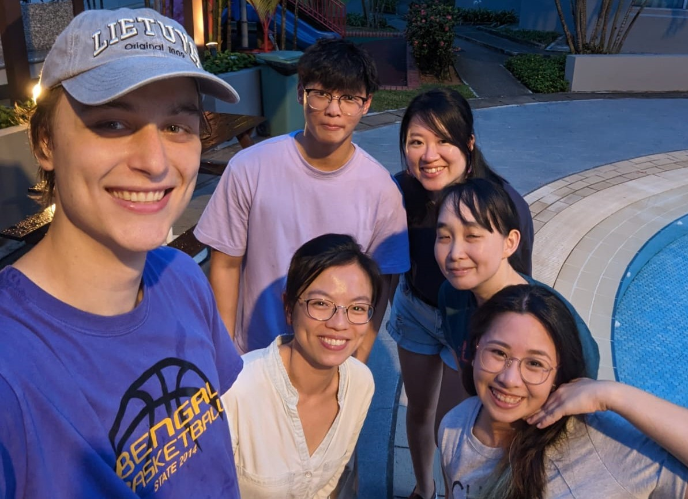
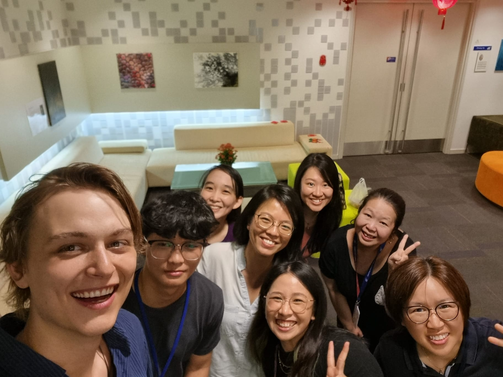
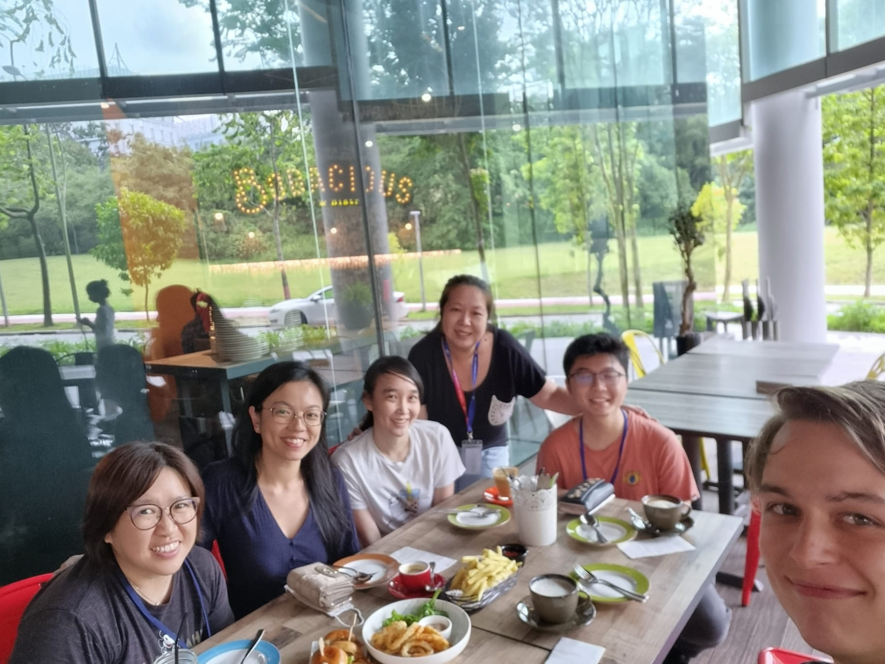

<meta name="viewport" content="width=device-containerwidth, initial-scale=1.0">
<link href="https://cdn.jsdelivr.net/npm/bootstrap@5.0.0-beta3/dist/css/bootstrap.min.css" rel="stylesheet" integrity="sha384-eOJMYsd53ii+scO/bJGFsiCZc+5NDVN2yr8+0RDqr0Ql0h+rP48ckxlpbzKgwra6" crossorigin="anonymous">
<link rel="stylesheet" type="text/css" href="css/main.css">

  

    
    <figcaption>(23/06/23) The prestigious Neuromics Bowling Championship of Singapore saw some incredible performances. Everyone is a champion!!!!</figcaption>
  

  

    
    <figcaption>(4/25/23) Jessica Xie's PhD thesis defendece at Yong Loo Lin School Of Medicine! Congratulations, Jessica!</figcaption>
  

  

    
    <figcaption>(24/3/23) The lab goes to Matas' for some quality Lithuanian bbq after hard work on a Friday. Matas is the best chief ever!!!</figcaption>
  

  <!-- 

    
    <figcaption>(2/2/23) Chinese New Year lab lunch. Gong Xi Fa Chai everyone!</figcaption>
  

  

    
    <figcaption>(16/1/23) Celebrating Matas' 24th birthday after some serious science in our monthly lab meeting. Happy Birthday Matas!</figcaption>
  

  

    
    <figcaption>(11/25/22) Goodbye lunch for Jonathan who finished his 6 month internship with us. Best of luck Jonathan!</figcaption>
  
 -->

